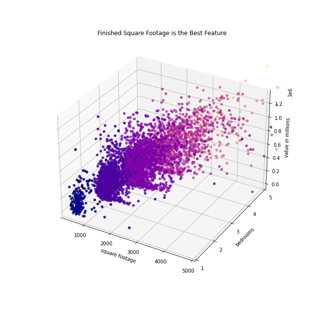

I am a data scientist at Zillow. This morning, I received the following email:

	We want to be able to predict the values of single-unit properties that the tax district assesses using the property data from those with a transaction during the "hot months" of May-August 2017.

	Property taxes are assessed at the county level. The data has the tax amounts and tax value of the home so it shouldn't be too hard to calculate. Please include in your report to us the distribution of tax rates for each county so that we can see how much they vary within the properties in the county and the rates most properties hover around.

	This is separate from the model you will build because, if you use tax amount in your model, you would be using a future data point to predict a future data point. For prediction purposes, we won't know tax amount until we know tax value.

---
- [Data](#data)
- [Hypotheses](#hypotheses)
- [Planning pipeline](#planning-pipeline)
- [Results](#results)

Audience: Zillow data team

Goals:
* Predict values of tax-assessed, single-unit properties bought or sold between May and August 2017. (Exclude tax amount from model.)
* Label properties' states and counties via tax rates calculated using tax values and tax amounts.
* Report tax rate distributions by county.

Artifacts:
* slides w/ drivers of single-unit property values - for 5 min presentation
* repo notebook w/ pipeline, 2 t-tests + viz, baseline and model, address email
* readme w/ reproduction instructions, goals, data dict, takeaways

## Data

| Feature                        | Description                                                                                                            |
|--------------------------------|------------------------------------------------------------------------------------------------------------------------|
| 'architecturalstyletypeid'     |  Architectural style of the home (i.e. ranch, colonial, split-level, etc…)                                             |
| 'basementsqft'                 |  Finished living area below or partially below ground level                                                            |
| 'bathroomcnt'                  |  Number of bathrooms in home including fractional bathrooms                                                            |
| 'bedroomcnt'                   |  Number of bedrooms in home                                                                                            |
| 'buildingqualitytypeid'        |  Overall assessment of condition of the building from best (lowest) to worst (highest)                                 |
| 'finishedfloor1squarefeet'     |  Size of the finished living area on the first (entry) floor of the home                                               |
| 'calculatedfinishedsquarefeet' |  Calculated total finished living area of the home                                                                     |
| 'finishedsquarefeet6'          | Base unfinished and finished area                                                                                      |
| 'finishedsquarefeet12'         | Finished living area                                                                                                   |
| 'finishedsquarefeet13'         | Perimeter  living area                                                                                                 |
| 'finishedsquarefeet15'         | Total area                                                                                                             |
| 'finishedsquarefeet50'         |  Size of the finished living area on the first (entry) floor of the home                                               |
| 'fips'                         |  Federal Information Processing Standard code -  see https://en.wikipedia.org/wiki/FIPS_county_code  |
| 'fireplacecnt'                 |  Number of fireplaces in a home (if any)                                                                               |
| 'garagecarcnt'                 |  Total number of garages on the lot including an attached garage                                                       |  
| 'latitude'                     |  Latitude of the middle of the parcel multiplied by 10e6                                                               |
| 'longitude'                    |  Longitude of the middle of the parcel multiplied by 10e6                                                              |
| 'lotsizesquarefeet'            |  Area of the lot in square feet                                                                                        |
| 'regionidcounty'               | County in which the property is located                                                                                |
| 'regionidcity'                 |  City in which the property is located (if any)                                                                        |
| 'regionidzip'                  |  Zip code in which the property is located                                                                             |   
| 'yearbuilt'                    |  The Year the principal residence was built                                                                            |
| 'taxvaluedollarcnt'            | The total tax assessed value of the parcel                                                                             |
| 'structuretaxvaluedollarcnt'   | The assessed value of the built structure on the parcel                                                                |
| 'landtaxvaluedollarcnt'        | The assessed value of the land area of the parcel                                                                      |
| 'taxamount'                    | The total property tax assessed for that assessment year                                                               |

Data: properties_2017 and predictions_2017
MVP X-variables: square feet of the home, number of bedrooms, number of bathrooms for target, property's assessed value aka taxvaluedollarcnt

## Hypotheses

### Mann-Whitney U Test

H0 The sample of home values from County A comes from the same population as County B (i.e. that they both have the same median).

H1 The samples from County A and County B come from different populations.

LAC and OC
* t-stat  = 40907982
* p-value = 9e-93

LAC and VC
* t-stat  = 13718420
* p-value = 1e-21

OC and VC
* t-stat  = 7250266
* p-value = 1e-5

**Reject all the nulls null. Median home values are different.**

### Pearson's correlation

H0 There is no linear correlation between house value and year built.

H1 There is a linear correlation between monthly charges and months tenure.

* Pearson correlation = 0.20876
* p-value             = 0.00000

**Reject the null.**

## Results